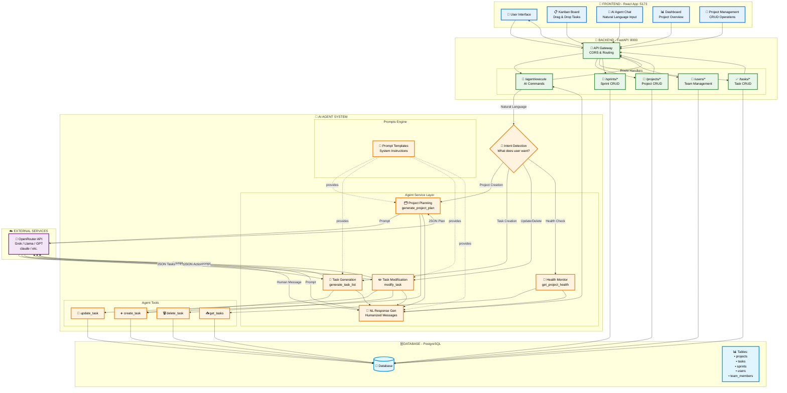
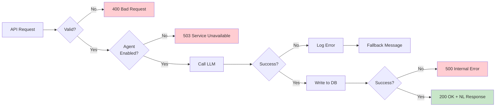

# 🏗️ PM-AI System Architecture & Data Flow

## System Architecture Diagram



## 📊 Detailed Data Flow

### 1️⃣ **User Creates Project via AI Chat**

```
User Input: "Create an e-commerce website with authentication and payment"
    ↓
Frontend (Chat) → POST /agent/execute
    ↓
Backend (AgentRoute) → Intent Detection → "Project Creation"
    ↓
Agent Service → generate_project_plan()
    ↓
Prompts Engine → Formats PLAN_GENERATION_PROMPT
    ↓
OpenRouter LLM → Returns JSON: {project_name, tasks[], milestones[]}
    ↓
Agent Tools → create_project() → create_task() (loop)
    ↓
PostgreSQL → INSERT INTO projects, tasks
    ↓
NL Response Gen → generate_natural_language_response()
    ↓
OpenRouter LLM → "I've created your e-commerce project with 12 tasks..."
    ↓
Backend → JSON Response with humanized message
    ↓
Frontend → Displays success message & updates Kanban board
```

### 2️⃣ **User Creates Task with Role Assignment**

```
User Input: "Create a task to optimize database queries"
    ↓
Intent Detection → "Single Task Creation"
    ↓
generate_task_list() → Checks team_members status
    ↓
LLM → Returns: {
  name: "Optimize Database Queries",
  assignee: "MK",
  assignment_reasoning: "Mike is the Backend Dev..."
}
    ↓
create_task() → INSERT INTO tasks
    ↓
NL Response → "I've assigned this to Mike since he's our backend expert..."
```

### 3️⃣ **User Updates Task via Natural Language**

```
User Input: "Move Login Page to high priority"
    ↓
Intent Detection → "Task Modification"
    ↓
modify_task() → LLM interprets: {action: "update", target: "login page"}
    ↓
get_tasks() → Searches for matching task
    ↓
update_task() → UPDATE tasks SET priority='high'
    ↓
NL Response → "I've updated the Login Page to high priority..."
```

### 4️⃣ **User Checks Project Health**

```
User Input: "How is the project doing?"
    ↓
Intent Detection → "Project Health"
    ↓
get_project_health() → Calculates metrics
    ↓
Returns: {
  total_tasks: 40,
  completion_rate: 30,
  overloaded_members: ["Alice"],
  burnout_risk: "Medium"
}
    ↓
NL Response → "The project is 30% complete. I'm concerned about Alice 
               having 6 active tasks. Consider reassigning to Bob..."
```

### 5️⃣ **User Drags Task on Kanban Board**

```
User Action: Drag task to "In Progress"
    ↓
Frontend → PUT /tasks/{id} {status: "In Progress"}
    ↓
Backend (TaskRoute) → Direct database update
    ↓
PostgreSQL → UPDATE tasks SET status='In Progress'
    ↓
Backend → JSON Response
    ↓
Frontend → Updates UI immediately
```

## 🔄 Key Integration Points

### Frontend ↔ Backend
- **Protocol**: REST API over HTTP
- **Format**: JSON
- **Authentication**: (To be implemented)
- **Real-time**: Polling (WebSocket planned)

### Backend ↔ AI Agent
- **Trigger**: `/agent/execute` endpoint
- **Input**: Natural language string + context
- **Output**: Structured response with humanized message
- **Error Handling**: Fallback messages on LLM failure

### AI Agent ↔ OpenRouter
- **Client**: AsyncOpenAI (async HTTP)
- **Models**: Configurable via `OPENROUTER_MODEL` env var
- **Temperature**: 0.1-0.7 depending on task type
- **Retry Logic**: Automatic on network errors

### Agent Tools ↔ Database
- **ORM**: SQLAlchemy (async)
- **Connection**: asyncpg
- **Transactions**: Automatic commit/rollback
- **Schema**: Auto-created on startup

## 🎯 Agent Intent Detection Logic

The agent uses keyword matching to route requests:

| **Intent** | **Keywords** | **Handler** |
|------------|--------------|-------------|
| Project Creation | "create project", "new project", "build a" | `generate_project_plan()` |
| Bulk Task Creation | "create tasks", "add tasks" + project_id | `generate_task_list()` |
| Single Task Creation | "create a task", "add a task" | `generate_task_list()` |
| Task Modification | "update", "change", "move", "delete" | `modify_task()` |
| Project Health | "status", "health", "how is", "progress" | `get_project_health()` |
| Default | Anything else | `generate_project_plan()` |

## 🛡️ Error Handling Flow



## 📈 Performance Characteristics

| **Operation** | **Avg Time** | **Bottleneck** |
|---------------|--------------|----------------|
| Simple Task Create | ~2s | LLM API call |
| Project Generation | ~5s | LLM + DB writes |
| Kanban Drag-Drop | <100ms | Local only |
| Health Check | ~1s | DB query |
| NL Response Gen | ~1-2s | Extra LLM call |

---

**Architecture Philosophy**: 
- **Separation of Concerns**: Frontend, Backend, AI Agent are loosely coupled
- **Async First**: All I/O operations are non-blocking
- **Fail-Safe**: Graceful degradation when AI is unavailable
- **Human-Centric**: AI speaks like a colleague, not a machine
